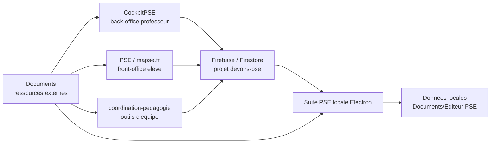
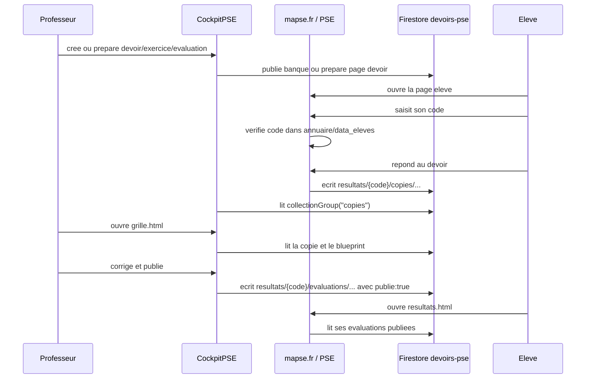

# Etat des lieux de l'ecosysteme PSE

Date de reference : 2026-08-09  
Machine locale : `/Users/brahms`  
Dossier de travail au moment de l'audit : `/Users/brahms/Documents/GitHub/CockpitPSE`  
Objectif du document : permettre a une IA ou a un humain de reprendre le systeme PSE sans chercher au hasard.

Ce fichier est une photographie de l'etat observe aujourd'hui. Il distingue volontairement :

- l'application locale Electron, qui vit dans `Documents/ATELIER COURS PSE` et stocke ses donnees dans `Documents/Éditeur PSE` ;
- le depot professeur `CockpitPSE`, qui sert a creer, piloter, corriger et suivre ;
- le depot eleve `PSE`, publie sous `mapse.fr` ;
- le depot `coordination-pedagogie`, qui contient les outils d'equipe et une partie pedagogie/coordination ;
- les ressources externes stockees dans `Documents`, qui servent de corpus, referentiel, sources officielles, manuels, guides, CCF, audits et brouillons.

Important : ne jamais supposer que l'etat local du depot `PSE` est identique a ce qui est publie sur `https://mapse.fr/`. Le site public a ete verifie comme repondant le 2026-08-09, mais le depot local `PSE` contient beaucoup de modifications non publiees.

## 1. Carte generale

L'ecosysteme est organise en cinq zones.



Lecture rapide :

- `CockpitPSE` fabrique, publie, corrige et pilote.
- `PSE` / `mapse.fr` diffuse aux eleves, recueille des reponses et affiche les resultats.
- Firestore, projet `devoirs-pse`, est la colonne vertebrale des flux en ligne.
- L'application Electron locale n'est pas le site eleve et n'est pas le cockpit. Elle sert a organiser localement les cours, progressions, classes, documents et ressources.
- L'application Electron possede seulement une passerelle en ligne : `centre-en-ligne.html`, qui lit certains retours Firestore et les sauvegarde localement.
- Les dossiers dans `Documents` sont essentiels : ils contiennent les sources pedagogiques, les referentiels, les manuels, les audits precedents, les CCF et des sauvegardes.

## 2. Emplacements principaux

### 2.1 Application locale Electron

Guide de reference :

`/Users/brahms/Documents/ATELIER COURS PSE/0_GUIDE_SUITE_PSE_pour_IA.md`

Moteur Electron :

`/Users/brahms/Documents/ATELIER COURS PSE/Editeur-PSE-Electron`

Code HTML/CSS/JS edite par l'application :

`/Users/brahms/Documents/ATELIER COURS PSE/EDITEUR`

Donnees utilisateur locales :

`/Users/brahms/Documents/Éditeur PSE`

Lanceurs declares dans le guide :

- `~/Desktop/Suite PSE.app`
- `~/Applications/Suite PSE.app`
- ces lanceurs pointent vers `/Users/brahms/Documents/ATELIER COURS PSE/Editeur-PSE-Electron`
- `/Applications/atelier pse.app` est autre chose : Automator lance `claude --remote-control atelier-pse`

Comptage local verifie le 2026-08-09 :

- `EDITEUR` : 72 fichiers HTML a la racine
- `EDITEUR/data` : 26 fichiers JS
- `EDITEUR/data-capa` : 51 fichiers JS
- `Editeur-PSE-Electron` : 13 fichiers JS a la racine

Point cle :

Le guide ne dit pas que l'application Electron charge une page professeur du cockpit. Il dit que l'application demarre sur `accueil.html` et que `centre-en-ligne.html` est une passerelle Firestore en lecture seule. Donc, a ce stade, l'editeur local ne doit pas etre decrit comme un chargeur de page prof CockpitPSE.

### 2.2 Depot professeur CockpitPSE

Depot local :

`/Users/brahms/Documents/GitHub/CockpitPSE`

Remote Git :

`https://github.com/Preventionsanteenvironnement/CockpitPSE.git`

Etat Git observe :

- branche : `main`
- suivi : `origin/main`
- fichiers non suivis : `main.js`, `scratch/`

Comptage local verifie le 2026-08-09 :

- 66 pages HTML a la racine
- 7 pages `editeur_*.html`
- 17 pages `prof_*.html`
- 4 pages `eleve_*.html`
- 39 fichiers JSON a la racine
- 178 fichiers HTML/JS/MD/JSON repertories par `rg --files` dans le depot

Documentation deja presente dans le depot :

- `/Users/brahms/Documents/GitHub/CockpitPSE/DOCUMENTATION_COCKPITPSE_MAPSE.md`
- `/Users/brahms/Documents/GitHub/CockpitPSE/AUDIT_COCKPITPSE_2026-07-21.md`

Ces deux fichiers sont des sources majeures. Il faut les relire avant toute intervention lourde.

### 2.3 Depot eleve PSE / mapse.fr

Depot local :

`/Users/brahms/Documents/GitHub/PSE`

Remote Git :

`https://github.com/Preventionsanteenvironnement/PSE.git`

Site public :

`https://mapse.fr/`

Page exercices publique :

`https://mapse.fr/exercices.html`

CNAME local :

`/Users/brahms/Documents/GitHub/PSE/CNAME` contient le domaine `mapse.fr`.

Etat Git observe :

- branche : `refonte-diagnostic-2026-07`
- suivi : `origin/refonte-diagnostic-2026-07`
- avance locale : 26 commits
- nombreux fichiers modifies, supprimes et non suivis
- fichiers modifies importants : `exercices.html`, `resultats.html`, plusieurs devoirs dans `devoirs/`
- fichiers supprimes localement : `eleve_ishikawa.html`, `eleve_itamami.html`, `eleve_mindmap.html`, `eleve_pad.html`, `eleve_qqoqcp.html`

Comptage local verifie le 2026-08-09 :

- 1069 fichiers HTML dans le depot local `PSE`

Attention :

Le depot local `PSE` est dans un etat de travail, pas dans un etat propre. Une IA doit toujours commencer par `git status --short --branch` avant de modifier ce depot.

### 2.4 Depot coordination-pedagogie

Depot local :

`/Users/brahms/Documents/GitHub/coordination-pedagogie`

Remote Git :

`https://github.com/Preventionsanteenvironnement/coordination-pedagogie.git`

Etat Git observe :

- branche : `main`
- suivi : `origin/main`
- modification locale : `.DS_Store`

Dossiers principaux observes :

- `/Users/brahms/Documents/GitHub/coordination-pedagogie/assets`
- `/Users/brahms/Documents/GitHub/coordination-pedagogie/canevas`
- `/Users/brahms/Documents/GitHub/coordination-pedagogie/chef-doeuvre`
- `/Users/brahms/Documents/GitHub/coordination-pedagogie/cps`
- `/Users/brahms/Documents/GitHub/coordination-pedagogie/enquete-aesh`
- `/Users/brahms/Documents/GitHub/coordination-pedagogie/fichiers`
- `/Users/brahms/Documents/GitHub/coordination-pedagogie/gevasco`
- `/Users/brahms/Documents/GitHub/coordination-pedagogie/guides`
- `/Users/brahms/Documents/GitHub/coordination-pedagogie/murs`
- `/Users/brahms/Documents/GitHub/coordination-pedagogie/parcours-pfmp`
- `/Users/brahms/Documents/GitHub/coordination-pedagogie/planning-aesh`
- `/Users/brahms/Documents/GitHub/coordination-pedagogie/planning-psr`
- `/Users/brahms/Documents/GitHub/coordination-pedagogie/projets`
- `/Users/brahms/Documents/GitHub/coordination-pedagogie/referentiel-agora`
- `/Users/brahms/Documents/GitHub/coordination-pedagogie/reunions`
- `/Users/brahms/Documents/GitHub/coordination-pedagogie/sondages`

Fichiers d'orientation :

- `/Users/brahms/Documents/GitHub/coordination-pedagogie/README.md`
- `/Users/brahms/Documents/GitHub/coordination-pedagogie/GUIDE.md`
- `/Users/brahms/Documents/GitHub/coordination-pedagogie/index.html`
- `/Users/brahms/Documents/GitHub/coordination-pedagogie/data.js`

### 2.5 Ressources externes dans Documents

Le dossier `Documents` contient la bibliotheque de travail. Il ne faut pas la reduire aux trois depots GitHub.

Chemins importants :

- `/Users/brahms/Documents/ATELIER COURS PSE`
- `/Users/brahms/Documents/ATELIER COURS PSE/REFERENTIEL`
- `/Users/brahms/Documents/ATELIER COURS PSE/BIBLIOTHEQUE`
- `/Users/brahms/Documents/ATELIER COURS PSE/BIBLIOTHEQUE_BACPRO`
- `/Users/brahms/Documents/ATELIER COURS PSE/MANUELS PAR MODULE`
- `/Users/brahms/Documents/ATELIER COURS PSE/INRS`
- `/Users/brahms/Documents/ATELIER COURS PSE/OUTILS`
- `/Users/brahms/Documents/ATELIER COURS PSE/Comprendre la PSE`
- `/Users/brahms/Documents/Éditeur PSE`
- `/Users/brahms/Documents/documents PSE`
- `/Users/brahms/Documents/les compétence en PSE` ou variante accentuee visible dans Finder
- `/Users/brahms/Documents/programme education nationale PSE`
- `/Users/brahms/Documents/livres PSE BACPRO`
- `/Users/brahms/Documents/ccf PSE 2026`
- `/Users/brahms/Documents/bacpse2026`
- `/Users/brahms/Documents/PSE-prive`
- `/Users/brahms/Documents/Socle_Competences_PSE`
- `/Users/brahms/Documents/RAPPORT_COORDINATION_PSR_pour_IA`
- `/Users/brahms/Documents/RAPPORT_PROGRESSION_PSE_pour_IA`
- `/Users/brahms/Documents/PSE_inventory_work`

Documents Markdown importants a ouvrir avant d'ecrire du contenu pedagogique :

- `/Users/brahms/Documents/CARTOGRAPHIE_SOURCES_REFERENTIEL_PSE.md`
- `/Users/brahms/Documents/REFERENCE_PSE_PROGRAMMES_ET_COMPETENCES.md`
- `/Users/brahms/Documents/DOCUMENTS_A_INTEGRER_PSE_CAP.md`
- `/Users/brahms/Documents/DOCUMENTS_A_INTEGRER_PSE_BACPRO.md`
- `/Users/brahms/Documents/INVENTAIRE_COMPETENCES_PSE_2026-07-24.md`
- `/Users/brahms/Documents/INVENTAIRE_DOCUMENTS_PSE_PAR_MODULE.md`
- `/Users/brahms/Documents/GUIDE_EXHAUSTIF_PSE_CAP_BACPRO_NINA.md`
- `/Users/brahms/Documents/SPECIFICATIONS_DOCUMENTS_PSE_ECHANTILLON.md`
- `/Users/brahms/Documents/audit_liens_orphelins_pse_2026-08-05.md`
- `/Users/brahms/Documents/audit_pse_cockpit_resultats_2026-08-05.md`
- `/Users/brahms/Documents/ETAT_DES_LIEUX_EDITEUR_PSE_2026-07-24.md`
- `/Users/brahms/Documents/PSE_inventory_work/Inventaire_documents_a_integrer_PSE_CAP_BacPro.md`
- `/Users/brahms/Documents/RAPPORT_COORDINATION_PSR_pour_IA/README.md`
- `/Users/brahms/Documents/RAPPORT_PROGRESSION_PSE_pour_IA/RAPPORT_PROGRESSION_PSE.md`

Documents importants dans `ATELIER COURS PSE` :

- `/Users/brahms/Documents/ATELIER COURS PSE/0_GUIDE_SUITE_PSE_pour_IA.md`
- `/Users/brahms/Documents/ATELIER COURS PSE/DIAGNOSTIC_MAPSE_2026-07.md`
- `/Users/brahms/Documents/ATELIER COURS PSE/RAPPORT_TRAVAUX_MAPSE_2026-07-10.md`
- `/Users/brahms/Documents/ATELIER COURS PSE/FIREBASE_REGLES_PROPOSITION.md`
- `/Users/brahms/Documents/ATELIER COURS PSE/CHARTE_GRAPHIQUE_MAPSE.md`
- `/Users/brahms/Documents/ATELIER COURS PSE/INVENTAIRE_COURS.md`
- `/Users/brahms/Documents/ATELIER COURS PSE/REFERENTIEL/INVENTAIRE_DOCUMENTS_PSE.md`
- `/Users/brahms/Documents/ATELIER COURS PSE/REFERENTIEL/REFERENTIEL_PSE_PROGRAMMES_ET_COMPETENCES.md`
- `/Users/brahms/Documents/ATELIER COURS PSE/HANDOFF_MAGER_PSE.md`
- `/Users/brahms/Documents/ATELIER COURS PSE/HANDOFF_MAGER_EVALUATIONS.md`

## 3. Application locale Electron

### 3.1 Role general

L'application locale est une suite de preparation, organisation et conservation personnelle. Elle n'est pas le site eleve, et elle n'est pas le cockpit professeur en ligne.

Formulation correcte :

Suite locale sans serveur pour travailler, avec un espace passerelle Firestore.

### 3.2 Pages principales dans `EDITEUR`

Chemin racine :

`/Users/brahms/Documents/ATELIER COURS PSE/EDITEUR`

Pages pivots :

- `accueil.html` : page d'accueil actuelle de l'application locale.
- `cours.html` : espace cours.
- `capa.html` : espace CAPa.
- `progression.html` : progressions.
- `eleves.html` : classes, eleves, profils et amenagements.
- `documents.html` : documents et ressources.
- `centre-en-ligne.html` : passerelle Firestore en lecture seule.
- `guides.html` : guides.
- `studio.html` : studio de production.
- `projection.html` : projection.
- `reunions-rendez-vous.html` : reunions et rendez-vous.

Fichiers partages :

- `classes-shared.js` expose `window.PSE_CLASSES`.
- `storage-shared.js` gere le stockage partage cote pages.
- `suite-nav.js` gere la navigation locale.

### 3.3 Moteur Electron

Chemin :

`/Users/brahms/Documents/ATELIER COURS PSE/Editeur-PSE-Electron`

Fichiers importants :

- `main.js`
- `preload.js`
- `store.js`
- `package.json`

Dans `package.json`, les scripts observes incluent :

- `start` : `electron .`
- `dist`
- `dist:local`
- `dist:dmg`

Le stockage passe par :

`StorageService` -> IPC `storeAPI` -> `store.js` -> fichiers JSON sur disque

### 3.4 Donnees locales persistantes

Chemin :

`/Users/brahms/Documents/Éditeur PSE`

Fichiers observes :

- `/Users/brahms/Documents/Éditeur PSE/store/classes.json`
- `/Users/brahms/Documents/Éditeur PSE/store/cours.json`
- `/Users/brahms/Documents/Éditeur PSE/store/capa.json`
- `/Users/brahms/Documents/Éditeur PSE/store/evaluations.json`
- `/Users/brahms/Documents/Éditeur PSE/store/progression-plan.json`
- `/Users/brahms/Documents/Éditeur PSE/store/progression-config.json`
- `/Users/brahms/Documents/Éditeur PSE/store/fiche-programme.json`
- `/Users/brahms/Documents/Éditeur PSE/store/planning.json`
- `/Users/brahms/Documents/Éditeur PSE/store/course-groups.json`
- `/Users/brahms/Documents/Éditeur PSE/store/preferences.json`
- `/Users/brahms/Documents/Éditeur PSE/store/manifest.json`
- `/Users/brahms/Documents/Éditeur PSE/Classes et copies/classes-et-regroupements.json`
- `/Users/brahms/Documents/Éditeur PSE/Centre en ligne/config.json`
- `/Users/brahms/Documents/Éditeur PSE/Centre en ligne/inbox.json`
- `/Users/brahms/Documents/Éditeur PSE/logs/startup.log`
- `/Users/brahms/Documents/Éditeur PSE/Sauvegardes automatiques/`

Regle importante :

Ne pas deplacer, renommer ou remplacer ce dossier sans plan de migration. C'est le stockage utilisateur de l'application locale.

### 3.5 Centre en ligne

Fichier :

`/Users/brahms/Documents/ATELIER COURS PSE/EDITEUR/centre-en-ligne.html`

Role :

Recevoir localement des informations venues de Firestore, notamment des retours MAPSE et quelques donnees de coordination. Il sert de tableau de reception et de sauvegarde locale.

Ce qu'il fait :

- detecte l'API Electron `window.onlineHubAPI` ;
- lit et sauvegarde dans `/Users/brahms/Documents/Éditeur PSE/Centre en ligne/` ;
- importe Firebase dynamiquement via `ensureFirebaseBridge()`;
- synchronise les copies et evaluations MAPSE via `syncMapseFirebase()`;
- synchronise une partie coordination via `syncCoordinationFirebase()`;
- lit `collectionGroup('copies')` et `collectionGroup('evaluations')` pour MAPSE ;
- lit `coordination_reunions` et `coordination_rdv` pour coordination.

Ce qu'il ne fait pas :

- il ne charge pas une page professeur CockpitPSE ;
- il ne remplace pas `CockpitPSE/index.html` ;
- il n'est pas une interface de correction ;
- il ne doit pas etre considere comme un editeur en ligne.

Fichiers Electron lies :

- `/Users/brahms/Documents/ATELIER COURS PSE/Editeur-PSE-Electron/preload.js` expose `onlineHubAPI`.
- `/Users/brahms/Documents/ATELIER COURS PSE/Editeur-PSE-Electron/main.js` gere les fichiers `Centre en ligne`.

### 3.6 Brique de rentree a prevoir dans Electron

L'application Electron devra probablement devenir le lieu prive de preparation de la rentree :

- import de la liste officielle des classes ;
- import ou saisie de la liste officielle des eleves ;
- creation des nouvelles classes manquantes ;
- generation de nouveaux codes eleves pour `mapse.fr` / `CockpitPSE` ;
- ajout ou correction d'un eleve en cours d'annee ;
- association de chaque code a un eleve local ;
- export des fichiers necessaires au cote public, sans nom/prenom ;
- export ou telechargement d'un annuaire prive pour le professeur ;
- diagnostic des doublons de codes, classes, eleves et identites.

Le point important est la separation des exports :

- export public : seulement `code + classe`, utilisable par `mapse.fr`, `CockpitPSE` et Firebase ;
- export prive : `code + nom + prenom + classe + eleveLocalId`, garde uniquement dans l'environnement local/professeur ;
- export de controle : rapport de generation, doublons, codes inutilises, eleves sans code, codes sans eleve.

Cette brique doit rester reversible et controlee. Elle ne doit pas modifier les donnees eleves sans sauvegarde, apercu et validation.

## 4. CockpitPSE

### 4.1 Role general

`CockpitPSE` est le back-office professeur :

- edition d'exercices ;
- edition d'evaluations ;
- edition de parcours ;
- edition de lire/ecrire ;
- quiz et activites live ;
- suivi de copies ;
- correction ;
- publication de resultats ;
- suivi de classe ;
- outils de notes et competences.

Il ne faut pas le confondre avec `mapse.fr`. Plusieurs boutons du cockpit ouvrent des pages eleves dans le depot `PSE`, souvent via des chemins relatifs du type `../PSE/...`.

### 4.2 Pages professeur et correction

Fichiers pivots :

- `/Users/brahms/Documents/GitHub/CockpitPSE/index.html`
- `/Users/brahms/Documents/GitHub/CockpitPSE/grille.html`
- `/Users/brahms/Documents/GitHub/CockpitPSE/dossier-classe.html`
- `/Users/brahms/Documents/GitHub/CockpitPSE/recap-notes.html`
- `/Users/brahms/Documents/GitHub/CockpitPSE/prof_eval_v2.html`

`index.html` :

- charge Firebase et Auth ;
- lit `collectionGroup(db, "copies")` ;
- lit `collectionGroup(db, "evaluations")` ;
- fusionne copies et evaluations par couple devoir/eleve ;
- classe les copies en a corriger, corrige non publie, publie ;
- prepare le transfert vers `grille.html` via `localStorage["cockpit_transfert"]` ;
- gere les demandes de deuxieme chance via `demandes_2chance` ;
- lit les alertes de doublons via `alertes_doublons`.

`grille.html` :

- recupere `cockpit_transfert` ;
- determine le code eleve ;
- lit la copie dans `resultats/{eleveCode}/copies/...` ;
- peut utiliser un fallback historique `devoirs_rendus` ;
- charge le blueprint depuis la copie ou depuis `https://mapse.fr/devoirs/{devoirId}_blueprint.json` ;
- corrige, sauvegarde et publie ;
- ecrit les corrections dans `resultats/{eleveCode}/evaluations/{devoirId}_eval` ;
- ecrit aussi des brouillons dans `resultats/{code}/brouillons`.

Attention connue :

Les brouillons sont ecrits mais l'audit precedent signale qu'ils ne sont pas relus correctement a la reouverture. A verifier avant de compter dessus.

### 4.3 Editeurs principaux du cockpit

#### Exercices en ligne

Editeur :

`/Users/brahms/Documents/GitHub/CockpitPSE/editeur_exercices.html`

Collection :

`exercices_banque`

Page eleve :

`/Users/brahms/Documents/GitHub/PSE/exercices.html`

Flux :

1. le professeur cree ou modifie un exercice dans `editeur_exercices.html` ;
2. l'exercice est enregistre dans `exercices_banque` ;
3. un nouvel exercice commence avec `publie:false` ;
4. le professeur publie l'exercice ;
5. `publie:true` rend l'exercice visible cote eleve ;
6. `PSE/exercices.html` lit les exercices publies.

Details techniques observes :

- lecture de `exercices_banque` via snapshot ;
- sauvegarde avec `setDoc(..., { merge:true })` ;
- bouton de test ouvrant `../PSE/exercices.html?preview=...` ;
- publication et depublication par champ `publie`.

Important :

Ce flux est un flux d'entrainement/consultation. `PSE/exercices.html` ne semble pas etre le flux principal de copie notee retournee au cockpit.

#### Exercices budget

Editeur :

`/Users/brahms/Documents/GitHub/CockpitPSE/editeur_exercices_budget.html`

Collection :

`exercices_banque`

Role :

Fork specialise pour les exercices de type budget. Il partage le reservoir principal avec les exercices standard.

#### Auto-evaluations modernes

Editeur :

`/Users/brahms/Documents/GitHub/CockpitPSE/editeur_eval_v2.html`

Collection :

`eval_banque_v2`

Page eleve :

`/Users/brahms/Documents/GitHub/PSE/eleve_eval_v2.html`

Pages prof :

- `/Users/brahms/Documents/GitHub/CockpitPSE/prof_eval_v2.html`
- `/Users/brahms/Documents/GitHub/CockpitPSE/recap-notes.html`

Flux :

1. le professeur cree une evaluation dans `editeur_eval_v2.html` ;
2. elle est stockee dans `eval_banque_v2` ;
3. elle est invisible tant que `publie:false` ;
4. le professeur publie ;
5. `PSE/eleve_eval_v2.html` lit `eval_banque` et `eval_banque_v2` ;
6. l'eleve se connecte avec son code ;
7. l'eleve repond ;
8. la page ecrit dans `eval_reponses` ;
9. elle ecrit aussi dans `resultats/{eleveCode}/copies/...` et `resultats/{eleveCode}/evaluations/...` ;
10. le cockpit lit les retours et peut suivre/corriger/publier.

Details observes :

- `eleve_eval_v2.html` utilise `data_eleves.js` comme base de codes eleves ;
- le doc de reponse `eval_reponses` est generalement indexe par couple `code_evalId` ;
- la page eleve masque les evaluations deja faites ;
- les resultats produits pour `resultats.html` incluent blueprint, competences et autocorrection.

#### Evaluation legacy

Ancien editeur :

`/Users/brahms/Documents/GitHub/CockpitPSE/editeur_eval.html`

Ancienne collection :

`eval_banque`

Page eleve ancienne :

`/Users/brahms/Documents/GitHub/PSE/eleve_eval.html`

Etat :

Legacy encore present. La V2 lit encore `eval_banque` et `eval_banque_v2` pour compatibilite. Ne pas supprimer sans verifier les evaluations anciennes.

#### Parcours

Editeur :

`/Users/brahms/Documents/GitHub/CockpitPSE/editeur_parcours.html`

Collections :

- `parcours_banque`
- references vers `exercices_banque`

Page eleve :

`/Users/brahms/Documents/GitHub/PSE/parcours.html`

Role :

Composer des parcours qui appellent des exercices existants par reference.

#### Lire et ecrire

Editeur :

`/Users/brahms/Documents/GitHub/CockpitPSE/editeur_lire_ecrire.html`

Collection :

`lire_ecrire_banque`

Page eleve :

`/Users/brahms/Documents/GitHub/PSE/lire_ecrire.html`

Role :

Banque d'activites d'aide lecture/ecriture.

#### Quiz live

Editeur :

`/Users/brahms/Documents/GitHub/CockpitPSE/editeur_quiz.html`

Pages prof/live :

- `/Users/brahms/Documents/GitHub/CockpitPSE/prof_quiz.html`
- `/Users/brahms/Documents/GitHub/CockpitPSE/wall_quiz.html`

Page eleve :

`/Users/brahms/Documents/GitHub/PSE/eleve_quiz.html`

Collections :

- `quiz_banque`
- `quiz_live_presence`
- `quiz_live_reponses`
- `quiz_live_config`

Role :

Activite live de classe, pas seulement une activite asynchrone.

#### Competences / JSON / Word

Fichier important :

`/Users/brahms/Documents/GitHub/CockpitPSE/editeur_eval_competences.html`

Role :

Outil de construction par competences avec exports/imports :

- prompt IA devoir ;
- prompt IA eleve ;
- devoir JSON ;
- correction eleve JSON ;
- eleve JSON ;
- classe JSON ;
- session JSON ;
- Word.

Fichier proche ou doublon :

`/Users/brahms/Documents/GitHub/CockpitPSE/editeur_bac_competences.html`

Attention :

L'audit precedent signale une duplication entre `editeur_eval_competences.html` et `editeur_bac_competences.html`, ainsi qu'un probleme de prise en compte de C1 dans `editeur_bac_competences.html`.

### 4.4 Activites live et pages associees

L'audit precedent signale plusieurs moteurs live :

- nuage ;
- meteo ;
- vrai/faux ;
- roue ;
- proust ;
- quiz emotions ;
- stress ;
- dilemme ;
- collectes ;
- demarche ;
- suivi de participation.

Ces pages s'appuient sur des collections Firestore dediees. Certaines pages eleves ou collectes ont ete signalees comme fragiles ou cassees dans l'audit precedent, notamment autour de `eleve_collecte.html` et de pages dediees supprimees localement.

Point critique observe :

Dans le depot local `PSE`, `eleve_collecte.html` a ete signale comme tronque a 81 octets lors d'une verification precedente, et les pages `eleve_ishikawa.html`, `eleve_itamami.html`, `eleve_mindmap.html`, `eleve_pad.html`, `eleve_qqoqcp.html` sont supprimees localement. Comme `PSE/index.html` peut pointer vers `eleve_collecte.html?mode=...`, ce flux doit etre recontrole avant utilisation en classe.

## 5. PSE / mapse.fr

### 5.1 Role general

`PSE` est le depot eleve. `mapse.fr` est la version publique.

Il contient :

- l'accueil eleve ;
- les cours CAP ;
- les cours Bac Pro ;
- les pages personnalisees ;
- les exercices autonomes ;
- les devoirs en ligne ;
- les auto-evaluations ;
- les resultats eleves ;
- les pages live ;
- des modules CPS, PFMP, revision, flashcards, escape games et ressources diverses.

Page publique verifiee le 2026-08-09 :

`https://mapse.fr/`

La page publique affiche notamment :

- un espace "Mon espace / Mes resultats" ;
- un guide d'utilisation ;
- des ressources de parcours Bac Pro ;
- des outils PFMP ;
- des modules "Se connaitre et progresser" ;
- des exercices en ligne ;
- des entrainements par competences CAP et Bac Pro ;
- des modules CAP et Bac Pro.

### 5.2 Fichiers eleves pivots

Accueil :

`/Users/brahms/Documents/GitHub/PSE/index.html`

Exercices dynamiques :

`/Users/brahms/Documents/GitHub/PSE/exercices.html`

Auto-evaluation moderne :

`/Users/brahms/Documents/GitHub/PSE/eleve_eval_v2.html`

Resultats eleves :

`/Users/brahms/Documents/GitHub/PSE/resultats.html`

Runner de devoirs HTML :

`/Users/brahms/Documents/GitHub/PSE/assets/pse-runner.js`

Annuaire de codes :

`/Users/brahms/Documents/GitHub/PSE/annuaire.js`

Base codes/classes :

`/Users/brahms/Documents/GitHub/PSE/data_eleves.js`

Dossier des devoirs :

`/Users/brahms/Documents/GitHub/PSE/devoirs`

### 5.3 Codes eleves et RGPD

`data_eleves.js` et `annuaire.js` stockent des codes eleves et classes. La logique observee privilegie le code eleve et evite les noms complets dans Firestore.

Principe :

- l'eleve entre un code ;
- la page verifie ce code localement ;
- la classe est deduite ;
- Firestore stocke surtout `eleveCode`, `classe`, reponses et resultats ;
- les noms reels doivent rester locaux ou absents du depot public.

Attention :

Un texte d'interface indique encore parfois "code compose de 8 chiffres", alors que les codes observes sont alphanumeriques courts. A corriger lors d'une passe UX.

### 5.4 Identite annuelle, codes et rentree prochaine

Element important ajoute le 2026-08-09 :

`CockpitPSE` et `mapse.fr` ont ete penses pour respecter le RGPD en fonctionnant par code eleve. Le code est remis a l'eleve et sert d'identifiant en ligne. Les noms, prenoms et, si possible, les informations d'etablissement ne doivent pas apparaitre dans les pages publiques ni dans les donnees en ligne ordinaires.

Etat actuel verifie :

- `PSE/data_eleves.js` contient des entrees de type `userCode + classe`, sans nom/prenom ;
- `PSE/annuaire.js` utilise le code pour retrouver la classe ;
- Firestore stocke les resultats sous des chemins de type `resultats/{eleveCode}/copies/...` et `resultats/{eleveCode}/evaluations/...` ;
- l'editeur local Electron a actuellement des eleves locaux avec `id`, `nom`, `prenom`, mais pas forcement le code MAPSE dans `classes.json` ;
- un annuaire prive existe dans `/Users/brahms/Documents/PSE-prive/annuaire_pse.csv`, avec une structure `code,nom_complet`.

Nuance importante :

Les codes observes actuellement sont des codes courts alphanumeriques de type `KA47`, pas strictement des codes a quatre chiffres. Pour la rentree prochaine, il est possible de choisir une convention de codes a quatre chiffres, mais il faudra l'appliquer partout et verifier les collisions.

La rentree prochaine change le modele :

- de nouvelles classes vont etre ajoutees ;
- deux classes manquantes aujourd'hui devront etre creees ;
- de nouveaux eleves vont arriver ;
- chaque eleve recevra un nouveau code ;
- certains eleves pourront etre ajoutes ou modifies en cours d'annee ;
- les codes cote `mapse.fr` / `CockpitPSE` devront etre reconcilies avec les eleves locaux Electron.

Il ne faut donc pas penser :

```text
code = eleve pour toujours
```

Il faut penser :

```text
annee scolaire + code eleve + classe MAPSE
→ eleve local Electron
```

Modele recommande pour une table locale privee :

```json
{
  "anneeScolaire": "2026-2027",
  "mappings": [
    {
      "eleveCode": "1234",
      "classeMapse": "C1PSR",
      "eleveLocalId": "eleve_xxx",
      "classeLocalId": "classe_yyy",
      "nom": "NOM",
      "prenom": "Prenom",
      "statut": "valide",
      "source": "import_liste_officielle"
    }
  ]
}
```

Chemin propose pour cette table locale :

`/Users/brahms/Documents/Éditeur PSE/store/identites-mapse.json`

Ou, si l'on veut historiser proprement par annee :

`/Users/brahms/Documents/Éditeur PSE/store/annees/2026-2027/identites-mapse.json`

Separation des responsabilites :

- `mapse.fr` / depot `PSE` public doit connaitre seulement `userCode + classe` ;
- Firestore doit continuer a recevoir les resultats sous code eleve ;
- `CockpitPSE` peut piloter et corriger avec les codes ;
- Electron peut connaitre la correspondance reelle code -> eleve, parce qu'il reste local et prive ;
- `centre-en-ligne.html` ne doit pas ecrire dans Firestore : il lit les retours en ligne et les depose localement ;
- la couche requete doit lire les JSON locaux, `inbox.json` et la table privee d'identites annuelles.

Point verifie sur "page prof" :

Aujourd'hui, le guide Electron et le code observes ne montrent pas que l'application locale charge directement une page prof `CockpitPSE`. Le pont local actuel est `centre-en-ligne.html`, qui synchronise Firestore en lecture seule et enregistre les retours dans `/Users/brahms/Documents/Éditeur PSE/Centre en ligne/inbox.json`. Electron peut referencer ou ouvrir des sources, mais le rattachement code -> eleve local doit etre gere par une table privee locale, pas par une dependance implicite a la page prof.

Objectif fonctionnel a ajouter a Electron :

Une page ou un module "Rentrée / Codes MAPSE" devrait permettre :

1. importer la liste officielle eleves/classes ;
2. creer ou mettre a jour les classes locales ;
3. generer un code unique pour chaque eleve ;
4. verifier l'absence de doublons ;
5. associer chaque code a `eleveLocalId` et `classeLocalId` ;
6. telecharger/exporter le fichier public `userCode + classe` pour `mapse.fr` ;
7. telecharger/exporter l'annuaire prive `code + nom + prenom + classe` ;
8. produire un rapport de controle ;
9. permettre l'ajout d'un eleve en cours d'annee sans casser l'historique.

Cette brique devient une condition forte pour exploiter les retours MAPSE dans la future couche requete.

### 5.5 Flux exercices en ligne

Page :

`/Users/brahms/Documents/GitHub/PSE/exercices.html`

Collection lue :

`exercices_banque`

Comportement :

- importe Firebase ;
- lit les documents avec `publie == true` ;
- peut lire un exercice precis pour un parcours ;
- supporte un mode preview ;
- n'a pas ete observe comme ecrivant les reponses dans Firestore.

Conclusion :

Cette page sert surtout a diffuser des exercices publies. Pour un devoir note avec retour vers cockpit, voir le flux `assets/pse-runner.js`.

### 5.6 Flux devoirs HTML avec copie envoyee

Runner :

`/Users/brahms/Documents/GitHub/PSE/assets/pse-runner.js`

Fonction centrale :

`window.envoyerCopie(code, pasteStats, eleveData)`

Collection cible :

`resultats/{eleveCode}/copies/{stableDocId}`

Comportement observe :

- initialise Firebase compat avec le projet `devoirs-pse` ;
- collecte les champs reponse de la page HTML ;
- gere plusieurs types de reponses : texte, QCM, matching, trous, matrices, risques ;
- calcule une note automatique si les donnees sont presentes ;
- construit un objet avec `eleveCode`, `devoirId`, `titre`, `classe`, `eleve`, `reponses`, `competences`, `note_auto`, `score`, `temps_secondes`, `pasteStats`, `focus`, `blueprint`, `tentative`, `chrono`, timestamps ;
- verifie l'existence d'une premiere copie pour eviter les doublons ;
- ecrit la copie dans Firestore ;
- garde un backup localStorage en cas d'echec ;
- peut demander une deuxieme chance via `demandes_2chance`.

Attention :

Le fichier commente une alerte doublon via `alertes_doublons`, mais l'ecriture effective de cette collection n'a pas ete confirmee dans le runner actuel. Le cockpit lit `alertes_doublons`, donc ce point est a auditer avant de compter sur les alertes.

### 5.7 Flux auto-evaluation

Page :

`/Users/brahms/Documents/GitHub/PSE/eleve_eval_v2.html`

Collections lues :

- `eval_banque`
- `eval_banque_v2`

Collections ecrites :

- `eval_reponses`
- `resultats/{eleveCode}/copies`
- `resultats/{eleveCode}/evaluations`

Comportement :

- l'eleve se connecte avec son code ;
- la page filtre les evaluations publiees ;
- elle verifie si l'eleve a deja repondu ;
- elle enregistre les reponses brutes dans `eval_reponses` ;
- elle produit une copie exploitable dans `resultats/{code}/copies` ;
- elle produit une evaluation exploitable dans `resultats/{code}/evaluations` ;
- la correction peut etre masquee cote eleve avec `publie:false`.

### 5.8 Flux resultats eleves

Page :

`/Users/brahms/Documents/GitHub/PSE/resultats.html`

Collections lues :

- `collectionGroup('copies')`
- `collectionGroup('evaluations')`
- `resultats/{code}/suivi`
- `resultats/{code}/stats`

Collections ecrites :

- `consultations/{code}` ;
- marques de lecture dans `resultats/{code}/evaluations/{devoirId}_eval` ;
- objectifs eleves dans `resultats/{code}/objectifs`.

Comportement :

- l'eleve se connecte par code ;
- la page filtre les resultats sur son code ;
- les evaluations avec `publie:false` sont masquees ;
- les corrections publiees sont visibles ;
- l'ouverture d'un detail peut marquer la correction comme lue.

### 5.9 Dossier `devoirs`

Chemin :

`/Users/brahms/Documents/GitHub/PSE/devoirs`

Role :

Contient les devoirs eleves HTML et leurs blueprints JSON.

Un devoir moderne doit generalement :

- charger `annuaire.js` ou un systeme equivalent de code eleve ;
- charger `assets/pse-runner.js` ;
- definir un `devoirId` stable ;
- contenir ou referencer un blueprint ;
- appeler `window.envoyerCopie(...)` avec les bons arguments.

Attention :

Certains devoirs anciens peuvent appeler `window.envoyerCopie()` sans arguments. Comme le runner moderne attend un code, il faut verifier chaque devoir avant de declarer qu'il fonctionne.

## 6. Firebase / Firestore

### 6.1 Projet

Projet Firebase observe :

`devoirs-pse`

Ce projet est utilise par :

- `CockpitPSE` ;
- `PSE` / `mapse.fr` ;
- `coordination-pedagogie` ;
- le `centre-en-ligne.html` de l'application locale.

Important :

Les configurations Firebase client sont presentes dans les fichiers HTML/JS. Ce n'est pas en soi le secret principal. La securite depend surtout des regles Firestore.

Document local critique :

`/Users/brahms/Documents/ATELIER COURS PSE/FIREBASE_REGLES_PROPOSITION.md`

Ce document signalait deja des regles trop permissives a durcir. Il faut verifier les regles reelles dans la console Firebase avant toute mise en production sensible.

### 6.2 Collections principales

| Collection ou chemin | Role | Producteur principal | Lecteur principal |
| --- | --- | --- | --- |
| `exercices_banque` | Exercices publies ou brouillons | Cockpit editeurs exercices | `PSE/exercices.html` |
| `parcours_banque` | Parcours d'entrainement | `editeur_parcours.html` | `PSE/parcours.html` |
| `lire_ecrire_banque` | Activites lire/ecrire | `editeur_lire_ecrire.html` | `PSE/lire_ecrire.html` |
| `eval_banque` | Banque evaluation legacy | `editeur_eval.html` | `eleve_eval_v2.html`, compat |
| `eval_banque_v2` | Banque evaluation moderne | `editeur_eval_v2.html` | `eleve_eval_v2.html` |
| `eval_reponses` | Reponses brutes auto-evals | `eleve_eval_v2.html` | Cockpit prof / recap |
| `resultats/{code}/copies` | Copies eleves | devoirs HTML, auto-evals | Cockpit, centre en ligne, resultats |
| `resultats/{code}/evaluations` | Corrections et evaluations | Cockpit, auto-evals | `resultats.html`, Cockpit |
| `resultats/{code}/brouillons` | Brouillons de correction | `grille.html` | A verifier |
| `resultats/{code}/suivi` | Suivi/participation | pages suivi Cockpit | Cockpit, resultats |
| `resultats/{code}/stats` | Statistiques de suivi | pages suivi | resultats |
| `consultations` | Traces de consultation eleve | `resultats.html` | Prof/statistiques |
| `demandes_2chance` | Demandes de deuxieme chance | `pse-runner.js` | `CockpitPSE/index.html` |
| `alertes_doublons` | Alertes doublons attendues | a confirmer | `CockpitPSE/index.html` |
| `quiz_banque` | Quiz | `editeur_quiz.html` | quiz eleve/prof |
| `quiz_live_presence` | Presence live quiz | quiz eleve | quiz prof/wall |
| `quiz_live_reponses` | Reponses live quiz | quiz eleve | quiz prof/wall |
| `quiz_live_config` | Configuration live quiz | quiz prof | quiz eleve/wall |
| `coordination_reunions` | Reunions equipe | coordination | coordination, centre en ligne |
| `coordination_rdv` | Rendez-vous/PFMP | coordination ou site lie | coordination, centre en ligne |
| `coordination_murs` | Murs d'idees | coordination | coordination |
| `coordination_sondages` | Sondages equipe | coordination | coordination |
| `coordination_projets` | Projets d'equipe | coordination | coordination |
| `coordination_chefdoeuvre` | Dossiers chef-d'oeuvre | coordination | coordination |
| `coordination_enquete_aesh` | Enquete AESH | coordination | coordination |
| `coordination_planning_aesh` | Planning AESH | coordination | coordination |
| `coordination_planning_messages` | Messages planning PSR | coordination | coordination |
| `coordination_canevas` | Canevas collaboratifs | coordination | coordination |
| `coordination_parcours` | Parcours PFMP | coordination | coordination |
| `coordination_gevasco` | GEVA-Sco | coordination | coordination |
| `analytics` | Compteurs de visites coordination | `assets/js/pulse.js` | coordination |

### 6.3 Flux complet devoir note



## 7. coordination-pedagogie

### 7.1 Role general

`coordination-pedagogie` est un portail et une boite a outils pour la coordination pedagogique.

Le depot contient :

- une page d'accueil ;
- une base de ressources dans `data.js` ;
- des outils de reunions ;
- des sondages ;
- des murs d'idees ;
- des projets ;
- du chef-d'oeuvre ;
- de l'AESH ;
- des plannings ;
- du PFMP ;
- des ressources CPS ;
- du GEVA-Sco ;
- des canevas.

Le README et le guide insistent sur une logique RGPD :

- pas de noms d'eleves ;
- pas de noms d'etablissements sensibles ;
- usage d'initiales ou roles quand necessaire.

### 7.2 Portail

Fichiers :

- `/Users/brahms/Documents/GitHub/coordination-pedagogie/index.html`
- `/Users/brahms/Documents/GitHub/coordination-pedagogie/data.js`

`index.html` contient un meta `robots` en `noindex`.

`data.js` structure les themes et les liens. Il renvoie notamment vers :

- `planning-aesh/`
- `planning-psr/`
- `reunions/`
- `murs/`
- `sondages/`
- `projets/`
- `chef-doeuvre/`
- `parcours-pfmp/`
- `cps/`
- des liens externes comme `https://preventionsanteenvironnement.github.io/rdv-pfmp/`

### 7.3 Collections Firestore coordination

Les outils coordination utilisent aussi le projet `devoirs-pse`.

Collections observees :

- `coordination_reunions`
- `coordination_rdv`
- `coordination_murs`
- `coordination_sondages`
- `coordination_projets`
- `coordination_chefdoeuvre`
- `coordination_enquete_aesh`
- `coordination_planning_aesh`
- `coordination_planning_messages`
- `coordination_canevas`
- `coordination_parcours`
- `coordination_gevasco`
- `analytics`
- `sondage_cps`

Lien avec l'application Electron :

`centre-en-ligne.html` lit seulement une partie de coordination, en particulier :

- `coordination_reunions`
- `coordination_rdv`

Il ne faut pas dire que tout `coordination-pedagogie` est synchronise localement.

## 8. Documents et ressources pedagogiques

### 8.1 Role

Les dossiers de `Documents` ne sont pas annexes. Ce sont les sources qui alimentent :

- les cours ;
- les evaluations ;
- les grilles ;
- les referentiels ;
- la pedagogie par competences ;
- les CCF ;
- les supports adaptes ;
- les audits ;
- les prompts IA ;
- les manuels et corriges.

Une IA qui fabrique un cours ou une evaluation PSE doit d'abord ouvrir les referentiels et inventaires locaux, puis seulement ensuite modifier les pages.

### 8.2 Ressources par usage

Pour comprendre les programmes et competences :

- `/Users/brahms/Documents/REFERENCE_PSE_PROGRAMMES_ET_COMPETENCES.md`
- `/Users/brahms/Documents/ATELIER COURS PSE/REFERENTIEL/REFERENTIEL_PSE_PROGRAMMES_ET_COMPETENCES.md`
- `/Users/brahms/Documents/les compétence en PSE`
- `/Users/brahms/Documents/Socle_Competences_PSE`
- `/Users/brahms/Documents/programme education nationale PSE`

Pour savoir quels documents integrer :

- `/Users/brahms/Documents/INVENTAIRE_DOCUMENTS_PSE_PAR_MODULE.md`
- `/Users/brahms/Documents/DOCUMENTS_A_INTEGRER_PSE_CAP.md`
- `/Users/brahms/Documents/DOCUMENTS_A_INTEGRER_PSE_BACPRO.md`
- `/Users/brahms/Documents/PSE_inventory_work/Inventaire_documents_a_integrer_PSE_CAP_BacPro.md`
- `/Users/brahms/Documents/ATELIER COURS PSE/REFERENTIEL/INVENTAIRE_DOCUMENTS_PSE.md`
- `/Users/brahms/Documents/ATELIER COURS PSE/REFERENTIEL/inventaire_documents_pse.json`

Pour la suite locale :

- `/Users/brahms/Documents/ATELIER COURS PSE/0_GUIDE_SUITE_PSE_pour_IA.md`
- `/Users/brahms/Documents/ETAT_DES_LIEUX_EDITEUR_PSE_2026-07-24.md`

Pour l'etat MAPSE / Cockpit :

- `/Users/brahms/Documents/GitHub/CockpitPSE/DOCUMENTATION_COCKPITPSE_MAPSE.md`
- `/Users/brahms/Documents/GitHub/CockpitPSE/AUDIT_COCKPITPSE_2026-07-21.md`
- `/Users/brahms/Documents/ATELIER COURS PSE/DIAGNOSTIC_MAPSE_2026-07.md`
- `/Users/brahms/Documents/ATELIER COURS PSE/RAPPORT_TRAVAUX_MAPSE_2026-07-10.md`
- `/Users/brahms/Documents/ATELIER COURS PSE/FIREBASE_REGLES_PROPOSITION.md`

Pour coordination :

- `/Users/brahms/Documents/RAPPORT_COORDINATION_PSR_pour_IA/README.md`
- `/Users/brahms/Documents/GitHub/coordination-pedagogie/README.md`
- `/Users/brahms/Documents/GitHub/coordination-pedagogie/GUIDE.md`

Pour la progression :

- `/Users/brahms/Documents/RAPPORT_PROGRESSION_PSE_pour_IA/RAPPORT_PROGRESSION_PSE.md`
- `/Users/brahms/Documents/ATELIER COURS PSE/INVENTAIRE_COURS.md`

Pour les CCF et grilles :

- `/Users/brahms/Documents/ccf PSE 2026`
- `/Users/brahms/Documents/bacpse2026`
- `/Users/brahms/Documents/CCF PSE 2006`
- `/Users/brahms/Documents/CCF PSE MAHMOUD`
- `/Users/brahms/Documents/Christina CCF PSE`
- `/Users/brahms/Documents/prompt verificateur CCF PSE`

## 9. Points rouges et dettes connues

### 9.1 Securite Firestore

Le document `/Users/brahms/Documents/ATELIER COURS PSE/FIREBASE_REGLES_PROPOSITION.md` signalait des regles trop permissives. Avant toute publication sensible, verifier dans Firebase :

- qui peut lire les banques ;
- qui peut ecrire les banques ;
- qui peut lire les copies ;
- qui peut ecrire les evaluations ;
- qui peut supprimer des documents ;
- si les comptes profs sont filtres par email ;
- si les collections coordination sont protegees correctement.

Risque majeur :

Certaines pages prof ou d'administration peuvent permettre des actions sensibles si les regles sont trop larges.

### 9.2 Etat Git local du depot PSE

Le depot `PSE` est tres modifie localement. Ne pas lancer de nettoyage, reset ou publication sans comprendre :

- les 26 commits d'avance ;
- les fichiers modifies ;
- les fichiers supprimes ;
- les nombreux fichiers non suivis ;
- l'ecart avec `mapse.fr`.

### 9.3 Pages collectes / live

Verifier avant usage :

- `PSE/eleve_collecte.html`
- `PSE/eleve_ishikawa.html`
- `PSE/eleve_itamami.html`
- `PSE/eleve_mindmap.html`
- `PSE/eleve_pad.html`
- `PSE/eleve_qqoqcp.html`
- les liens de `PSE/index.html` vers `eleve_collecte.html?mode=...`

Etat connu :

Des pages dediees sont supprimees localement et `eleve_collecte.html` a ete signale comme tronque lors d'une verification precedente.

### 9.4 Alertes doublons

Le cockpit lit `alertes_doublons`, mais l'ecriture effective par `PSE/assets/pse-runner.js` doit etre confirmee. Ne pas declarer la fonctionnalite robuste avant test reel.

### 9.5 Deuxieme chance

Le runner ecrit des demandes dans `demandes_2chance`, et `CockpitPSE/index.html` les lit et peut accepter/refuser. Ce flux existe, mais doit etre teste avec un devoir recent avant usage en classe.

### 9.6 Brouillons de correction

`grille.html` ecrit dans `resultats/{code}/brouillons`, mais l'audit precedent indique que les brouillons ne sont pas relus correctement. A reparer ou documenter.

### 9.7 Doublons d'editeurs competences

`editeur_eval_competences.html` et `editeur_bac_competences.html` se recoupent. L'audit precedent signale aussi un probleme C1 dans `editeur_bac_competences.html`.

### 9.8 RGPD historique

L'audit precedent signalait une exposition de vrais noms dans l'historique Git autour de CCF4. Meme si le fichier courant a ete anonymise, l'historique doit etre traite comme sensible.

### 9.9 `.DS_Store`

`coordination-pedagogie` a `.DS_Store` modifie. `CockpitPSE` et coordination peuvent manquer de `.gitignore` adapte. Eviter de committer des fichiers systeme macOS.

### 9.10 Application locale et page prof

Ne pas melanger :

- `centre-en-ligne.html` lit Firestore et stocke localement ;
- `CockpitPSE/index.html` est le cockpit prof ;
- le guide de l'application locale ne documente pas un chargement de page prof dans Electron.

### 9.11 Identites eleves et changement d'annee

Risque majeur pour la couche requete :

Les retours MAPSE/Cockpit arrivent sous code eleve. Les donnees locales Electron connaissent les eleves par identifiants locaux, noms et prenoms. Si la correspondance n'est pas structuree par annee scolaire, les analyses peuvent rattacher une copie au mauvais eleve.

Points a verifier avant la rentree :

- convention des codes : alphanumerique court ou quatre chiffres stricts ;
- unicite des codes pour l'annee ;
- non-reutilisation dangereuse d'un code dans la meme annee ;
- table privee code -> eleve local ;
- correspondance classe MAPSE -> classe locale ;
- deux classes manquantes a creer ;
- procedure d'ajout d'un eleve en cours d'annee ;
- exports publics sans nom/prenom ;
- exports prives non publies ;
- sauvegarde avant toute generation ou import.

Regle :

Ne jamais publier l'annuaire prive code + nom/prenom dans le depot `PSE`, sur `mapse.fr`, dans `CockpitPSE` public ou dans Firestore si ce n'est pas strictement necessaire et encadre par des regles.

## 10. Methode de reprise pour une IA

### 10.1 Toujours commencer par ces lectures

1. Lire ce fichier :
   `/Users/brahms/Documents/GitHub/CockpitPSE/ETAT_DES_LIEUX_ECOSYSTEME_PSE_2026-08-09.md`
2. Lire le guide Electron :
   `/Users/brahms/Documents/ATELIER COURS PSE/0_GUIDE_SUITE_PSE_pour_IA.md`
3. Lire la documentation Cockpit/MAPSE :
   `/Users/brahms/Documents/GitHub/CockpitPSE/DOCUMENTATION_COCKPITPSE_MAPSE.md`
4. Lire l'audit Cockpit :
   `/Users/brahms/Documents/GitHub/CockpitPSE/AUDIT_COCKPITPSE_2026-07-21.md`
5. Lire les docs Firebase :
   `/Users/brahms/Documents/ATELIER COURS PSE/FIREBASE_REGLES_PROPOSITION.md`
6. Lire les docs pedagogiques utiles selon le travail :
   `/Users/brahms/Documents/REFERENCE_PSE_PROGRAMMES_ET_COMPETENCES.md`
   `/Users/brahms/Documents/INVENTAIRE_DOCUMENTS_PSE_PAR_MODULE.md`

### 10.2 Toujours verifier l'etat Git

Commandes utiles :

```bash
git -C /Users/brahms/Documents/GitHub/CockpitPSE status --short --branch
git -C /Users/brahms/Documents/GitHub/PSE status --short --branch
git -C /Users/brahms/Documents/GitHub/coordination-pedagogie status --short --branch
```

Ne jamais faire de `git reset --hard`, `git checkout -- .` ou suppression massive sans demande explicite.

### 10.3 Pour comprendre un flux eleve en ligne

Ouvrir dans cet ordre :

1. `/Users/brahms/Documents/GitHub/PSE/index.html`
2. `/Users/brahms/Documents/GitHub/PSE/annuaire.js`
3. `/Users/brahms/Documents/GitHub/PSE/data_eleves.js`
4. la page eleve concernee, par exemple `eleve_eval_v2.html` ou un devoir dans `devoirs/`
5. `/Users/brahms/Documents/GitHub/PSE/assets/pse-runner.js`
6. `/Users/brahms/Documents/GitHub/PSE/resultats.html`
7. `/Users/brahms/Documents/GitHub/CockpitPSE/index.html`
8. `/Users/brahms/Documents/GitHub/CockpitPSE/grille.html`

### 10.4 Pour comprendre un editeur cockpit

Ouvrir :

1. la page `editeur_*.html` ;
2. chercher `firebaseConfig` ;
3. chercher `collection(`, `setDoc`, `addDoc`, `onSnapshot`, `publie` ;
4. chercher les boutons `tester`, `publier`, `depublier`, `importer`, `exporter` ;
5. ouvrir la page eleve liee dans `PSE` ;
6. verifier que les champs de Firestore sont compatibles.

### 10.5 Pour creer ou reparer un devoir note

Verifier :

- le devoir HTML dans `/Users/brahms/Documents/GitHub/PSE/devoirs` ;
- le `devoirId` ;
- le blueprint embarque ou le fichier `{devoirId}_blueprint.json` ;
- le chargement de `annuaire.js` ;
- le chargement de `assets/pse-runner.js` ;
- l'appel a `window.envoyerCopie(code, pasteStats, eleveData)` ;
- le chemin Firestore attendu : `resultats/{eleveCode}/copies/{devoirId}_copie_1` ou variante stable ;
- la lecture dans `CockpitPSE/index.html` ;
- l'ouverture dans `grille.html` ;
- la publication dans `resultats/{eleveCode}/evaluations/{devoirId}_eval` ;
- l'affichage dans `PSE/resultats.html`.

### 10.6 Pour modifier l'application Electron

Ouvrir :

1. `/Users/brahms/Documents/ATELIER COURS PSE/0_GUIDE_SUITE_PSE_pour_IA.md`
2. `/Users/brahms/Documents/ATELIER COURS PSE/Editeur-PSE-Electron/main.js`
3. `/Users/brahms/Documents/ATELIER COURS PSE/Editeur-PSE-Electron/preload.js`
4. `/Users/brahms/Documents/ATELIER COURS PSE/Editeur-PSE-Electron/store.js`
5. la page dans `/Users/brahms/Documents/ATELIER COURS PSE/EDITEUR`
6. les donnees dans `/Users/brahms/Documents/Éditeur PSE/store`

Ne pas ecrire dans les donnees utilisateur sans sauvegarde.

### 10.7 Pour modifier coordination-pedagogie

Ouvrir :

1. `/Users/brahms/Documents/GitHub/coordination-pedagogie/README.md`
2. `/Users/brahms/Documents/GitHub/coordination-pedagogie/GUIDE.md`
3. `/Users/brahms/Documents/GitHub/coordination-pedagogie/data.js`
4. l'outil concerne, par exemple `reunions/index.html`, `sondages/index.html`, `projets/app.js`
5. verifier la collection Firestore `coordination_*`
6. verifier les regles RGPD : initiales, roles, pas de noms eleves

### 10.8 Pour preparer la rentree et les codes eleves

Ouvrir :

1. `/Users/brahms/Documents/Éditeur PSE/store/classes.json`
2. `/Users/brahms/Documents/PSE-prive/annuaire_pse.csv`
3. `/Users/brahms/Documents/GitHub/PSE/data_eleves.js`
4. `/Users/brahms/Documents/GitHub/PSE/annuaire.js`
5. `/Users/brahms/Documents/ATELIER COURS PSE/EDITEUR/centre-en-ligne.html`
6. `/Users/brahms/Documents/Éditeur PSE/Centre en ligne/inbox.json`

Verifier :

- combien de classes locales existent ;
- quelles classes manquent ;
- combien d'eleves ont un identifiant local ;
- combien d'eleves ont un code MAPSE associe ;
- si les codes publics sont bien sans nom/prenom ;
- si l'annuaire prive est bien garde hors depot public ;
- si les retours `inbox.json` peuvent etre rattaches a un eleve local.

Objectif de la brique Electron a creer :

- importer la liste officielle de rentree ;
- generer les codes ;
- afficher les collisions et ambiguites ;
- valider manuellement les associations ;
- sauvegarder une table privee annuelle ;
- exporter/telecharger le fichier public `userCode + classe` ;
- exporter/telecharger l'annuaire prive professeur ;
- produire un rapport de controle.

## 11. Fichiers pivots a connaitre

| Zone | Fichier | Role |
| --- | --- | --- |
| Electron | `/Users/brahms/Documents/ATELIER COURS PSE/0_GUIDE_SUITE_PSE_pour_IA.md` | Guide de reference de la suite locale |
| Electron | `/Users/brahms/Documents/ATELIER COURS PSE/EDITEUR/accueil.html` | Accueil de l'application locale |
| Electron | `/Users/brahms/Documents/ATELIER COURS PSE/EDITEUR/centre-en-ligne.html` | Passerelle Firestore lecture seule |
| Electron | `/Users/brahms/Documents/ATELIER COURS PSE/Editeur-PSE-Electron/main.js` | Process principal Electron |
| Electron | `/Users/brahms/Documents/ATELIER COURS PSE/Editeur-PSE-Electron/preload.js` | API exposee aux pages |
| Electron | `/Users/brahms/Documents/ATELIER COURS PSE/Editeur-PSE-Electron/store.js` | Ecriture/lecture JSON locale |
| Donnees locales | `/Users/brahms/Documents/Éditeur PSE/store/classes.json` | Classes locales |
| Donnees locales | `/Users/brahms/Documents/Éditeur PSE/store/cours.json` | Cours locaux |
| Donnees locales | `/Users/brahms/Documents/Éditeur PSE/Centre en ligne/inbox.json` | Reception centre en ligne |
| Donnees locales | `/Users/brahms/Documents/PSE-prive/annuaire_pse.csv` | Annuaire prive code/nom |
| Donnees locales | `/Users/brahms/Documents/Éditeur PSE/store/identites-mapse.json` | Proposition de table privee annuelle code -> eleve local |
| Cockpit | `/Users/brahms/Documents/GitHub/CockpitPSE/index.html` | Tableau de bord prof |
| Cockpit | `/Users/brahms/Documents/GitHub/CockpitPSE/grille.html` | Correction et publication |
| Cockpit | `/Users/brahms/Documents/GitHub/CockpitPSE/editeur_exercices.html` | Edition exercices |
| Cockpit | `/Users/brahms/Documents/GitHub/CockpitPSE/editeur_eval_v2.html` | Edition auto-evals |
| Cockpit | `/Users/brahms/Documents/GitHub/CockpitPSE/editeur_parcours.html` | Edition parcours |
| Cockpit | `/Users/brahms/Documents/GitHub/CockpitPSE/editeur_lire_ecrire.html` | Edition lire/ecrire |
| Cockpit | `/Users/brahms/Documents/GitHub/CockpitPSE/editeur_quiz.html` | Edition quiz live |
| PSE | `/Users/brahms/Documents/GitHub/PSE/index.html` | Accueil mapse.fr |
| PSE | `/Users/brahms/Documents/GitHub/PSE/exercices.html` | Exercices dynamiques |
| PSE | `/Users/brahms/Documents/GitHub/PSE/eleve_eval_v2.html` | Auto-evaluation eleve |
| PSE | `/Users/brahms/Documents/GitHub/PSE/resultats.html` | Resultats eleves |
| PSE | `/Users/brahms/Documents/GitHub/PSE/assets/pse-runner.js` | Envoi de copies |
| PSE | `/Users/brahms/Documents/GitHub/PSE/annuaire.js` | Code eleve et envoi legacy |
| PSE | `/Users/brahms/Documents/GitHub/PSE/data_eleves.js` | Base codes/classes |
| Coordination | `/Users/brahms/Documents/GitHub/coordination-pedagogie/index.html` | Portail coordination |
| Coordination | `/Users/brahms/Documents/GitHub/coordination-pedagogie/data.js` | Donnees de navigation |
| Coordination | `/Users/brahms/Documents/GitHub/coordination-pedagogie/reunions/index.html` | Reunions |
| Coordination | `/Users/brahms/Documents/GitHub/coordination-pedagogie/sondages/index.html` | Sondages |
| Coordination | `/Users/brahms/Documents/GitHub/coordination-pedagogie/projets/app.js` | Projets collaboratifs |
| Coordination | `/Users/brahms/Documents/GitHub/coordination-pedagogie/murs/app.js` | Murs d'idees |
| Coordination | `/Users/brahms/Documents/GitHub/coordination-pedagogie/chef-doeuvre/app.js` | Chef-d'oeuvre |

## 12. Conclusions operationnelles

1. Le coeur relationnel actuel est clair : `CockpitPSE` cote prof, `PSE/mapse.fr` cote eleve, Firestore `devoirs-pse` entre les deux.
2. L'application Electron locale est separee, mais elle peut lire certains retours via `centre-en-ligne.html`.
3. `coordination-pedagogie` partage le meme projet Firebase, mais dans des collections `coordination_*`.
4. Les ressources de `Documents` sont indispensables pour produire du contenu juste et coherent.
5. La plus grande vigilance porte sur les regles Firestore, l'etat Git tres modifie de `PSE`, les pages live/collecte, les brouillons de `grille.html`, les alertes doublons et les anciennes pages de devoirs.
6. Une IA qui reprend doit toujours cartographier avant d'ecrire : chemins, git status, collections Firestore, page prof, page eleve, runner, resultats.
7. Pour la rentree, la brique prioritaire est l'identite annuelle : generer ou importer les codes, exporter les fichiers publics/prives, puis permettre a Electron de rattacher chaque retour MAPSE/Cockpit au bon eleve local sans exposer les noms en ligne.

## 13. Sources verifiees pendant cette synthese

Sources locales :

- `/Users/brahms/Documents/ATELIER COURS PSE/0_GUIDE_SUITE_PSE_pour_IA.md`
- `/Users/brahms/Documents/GitHub/CockpitPSE/DOCUMENTATION_COCKPITPSE_MAPSE.md`
- `/Users/brahms/Documents/GitHub/CockpitPSE/AUDIT_COCKPITPSE_2026-07-21.md`
- `/Users/brahms/Documents/ATELIER COURS PSE/EDITEUR/centre-en-ligne.html`
- `/Users/brahms/Documents/ATELIER COURS PSE/Editeur-PSE-Electron/main.js`
- `/Users/brahms/Documents/ATELIER COURS PSE/Editeur-PSE-Electron/preload.js`
- `/Users/brahms/Documents/GitHub/CockpitPSE/index.html`
- `/Users/brahms/Documents/GitHub/CockpitPSE/grille.html`
- `/Users/brahms/Documents/GitHub/CockpitPSE/editeur_exercices.html`
- `/Users/brahms/Documents/GitHub/CockpitPSE/editeur_eval_v2.html`
- `/Users/brahms/Documents/GitHub/PSE/exercices.html`
- `/Users/brahms/Documents/GitHub/PSE/eleve_eval_v2.html`
- `/Users/brahms/Documents/GitHub/PSE/resultats.html`
- `/Users/brahms/Documents/GitHub/PSE/assets/pse-runner.js`
- `/Users/brahms/Documents/GitHub/PSE/annuaire.js`
- `/Users/brahms/Documents/GitHub/PSE/data_eleves.js`
- `/Users/brahms/Documents/Éditeur PSE/store/classes.json`
- `/Users/brahms/Documents/PSE-prive/annuaire_pse.csv`
- `/Users/brahms/Documents/GitHub/coordination-pedagogie/index.html`
- `/Users/brahms/Documents/GitHub/coordination-pedagogie/data.js`
- `/Users/brahms/Documents/GitHub/coordination-pedagogie/README.md`
- `/Users/brahms/Documents/GitHub/coordination-pedagogie/GUIDE.md`

Sources web verifiees le 2026-08-09 :

- `https://mapse.fr/`
- `https://mapse.fr/exercices.html`
- `https://github.com/Preventionsanteenvironnement/CockpitPSE`
- `https://github.com/Preventionsanteenvironnement/PSE`
- `https://github.com/Preventionsanteenvironnement/coordination-pedagogie`
